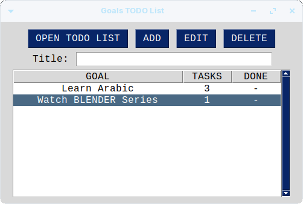
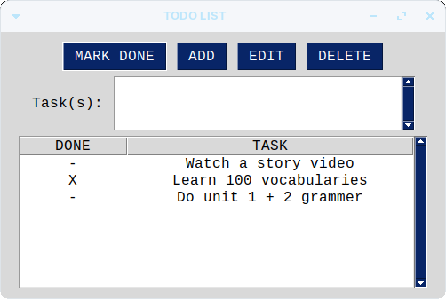

# goals-todo-list
A todo list for each goal. Achieve your goals by finishing their todo list.




To execute, run the 'sg.py' file. (Make sure you have PySimpleGUI installed as well)

```console
pip install PySimpleGUI
python3 ./sg.py
```
### Note
Finished tasks are represented with 'X', whereas unfinished ones are a '-'.
